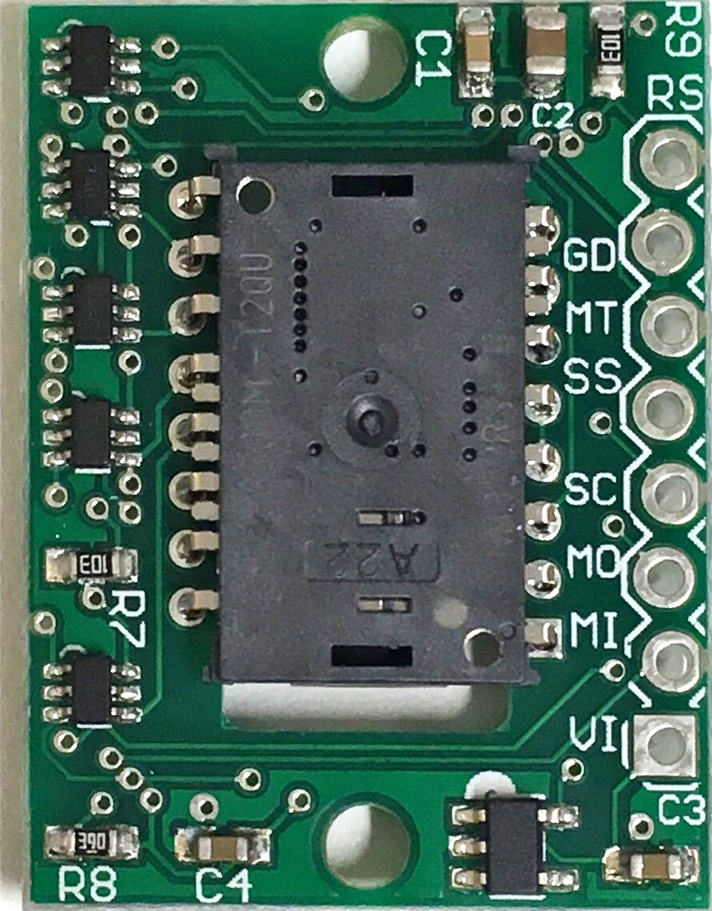

# PMW3389
Interfacing PixArt PMW3389 with Arduino boards

# Parts info
* PMW3389 Module: https://www.tindie.com/products/jkicklighter/pmw3389-motion-sensor/ by JACK Enterprises
  * 
* Base source code: https://github.com/mrjohnk/PMW3389DM by mrjohnk
* Teensy LC (https://www.pjrc.com/store/teensy.html) with Teensyduino (https://www.pjrc.com/teensy/teensyduino.html)
  * Arduino Leonardo: https://www.arduino.cc/en/Main/Arduino_BoardLeonardo

# Pin connection
* MI = MISO
* MO = MOSI
* SS = Slave Select / Chip Select
* SC = SPI Clock
* MT = Motion (active low interrupt line)
* RS = Reset
* GD = Ground
* VI = Voltage in up to +5.5V

```
[Module] --- [Teensy]
      RS --- (NONE)
      GD --- GND
      MT --- (NONE)
      SS --- Pin 10
      SC --- SCK
      MO --- MOSI
      MI --- MISO
      VI --- 3.3V

// in Mouse example
[Button] --- [Teensy]
    Left --- Pin 3
   Right --- Pin 0
  Middle --- Pin 2
    Back --- Pin 1
   
* Connect the other pole of a button to GND
```

# Sketch Descriptions
* PMW3389DM-Mouse/
  * Fully functional trackball (w. 1k polling rate) with four buttons (left, right, middle, back)
  * Default CPI and debounce time can be set (see #define sections in the source code)
  * Cycle through CPI with button combo (middle + right click)
  * Commands (newline (\n) should be placed at the end of each command)
    * Q: toggle surface quality report (can be seen thorugh Serial Monitor or Serial Plotter)
    * I: print device signature
    * C[number]: Set cpi level, example) C1600\n   = set CPI to 1600.

# How to use
  * Build the circuit as described.
  * (Arduino only) Copy the /library/AdvMouse/ to your Arduino library folder
  * Load PMW3389DM-Mouse on Arduino IDE.
    * Modify dx, dy for your sensor orientation
    
# Wishlist
 * Deal with the scroll ring encoder
 
# Construction
  * 
  * 
  * 
